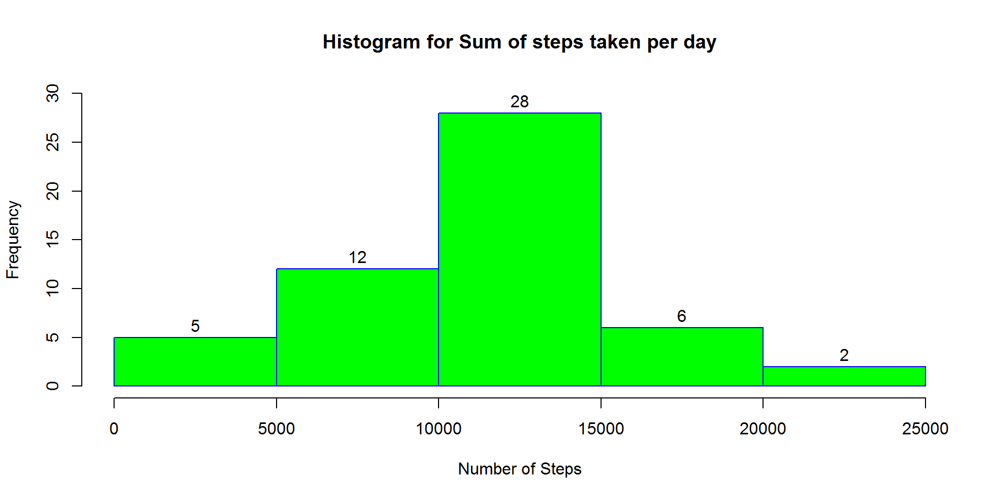
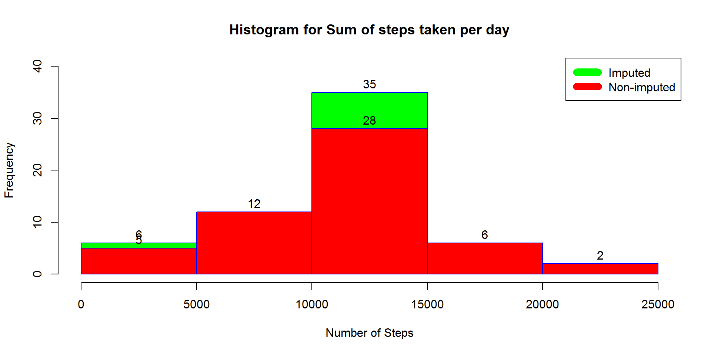
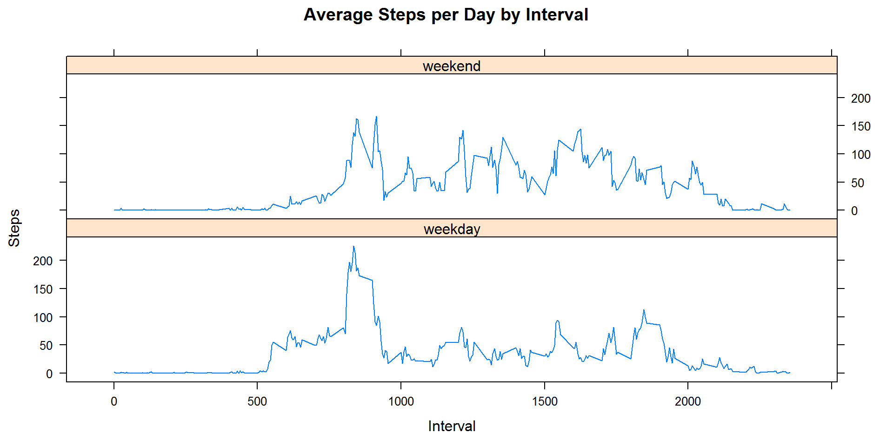

    knitr::opts_chunk$set(echo = TRUE)

### Introduction

It is now possible to collect a large amount of data about personal
movement using activity monitoring devices such as a Fitbit, Nike
Fuelband, or Jawbone Up. These type of devices are part of the
quantified self movement a group of enthusiasts who take measurements
about themselves regularly to improve their health, to find patterns in
their behavior, or because they are tech geeks. But these data remain
under-utilized both because the raw data are hard to obtain and there is
a lack of statistical methods and software for processing and
interpreting the data.

This project makes use of data from a personal activity monitoring
device. This device collects data at 5 minute intervals through out the
day. The data consists of two months of data from an anonymous
individual collected during the months of October and November, 2012 and
include the number of steps taken in 5 minute intervals each day.

The variables included in this dataset are:

**steps**: Number of steps taking in a 5-minute interval (missing values
are coded as NA)

**date**: The date on which the measurement was taken in YYYY-MM-DD
format

**interval**: Identifier for the 5-minute interval in which measurement
was taken

The dataset is stored in a comma-separated-value (CSV) file and there
are a total of 17,568 observations in this dataset.

**Loading the required libraries for the project: dplyr and lattic**

    library("dplyr")

    ## Warning: package 'dplyr' was built under R version 3.3.3

    ## 
    ## Attaching package: 'dplyr'

    ## The following objects are masked from 'package:stats':
    ## 
    ##     filter, lag

    ## The following objects are masked from 'package:base':
    ## 
    ##     intersect, setdiff, setequal, union

    library("lattice")

*Reading the CSV in data frame*

    actdata <- read.csv("E:\\course5\\activity\\activity.csv")

Below is total number of steps taken per day
--------------------------------------------

    sumstepsfordays <- actdata %>% group_by(date) %>% summarise(steps=sum(steps))
    sumstepsfordays

    ## # A tibble: 61 x 2
    ##          date steps
    ##        <fctr> <int>
    ##  1 2012-10-01    NA
    ##  2 2012-10-02   126
    ##  3 2012-10-03 11352
    ##  4 2012-10-04 12116
    ##  5 2012-10-05 13294
    ##  6 2012-10-06 15420
    ##  7 2012-10-07 11015
    ##  8 2012-10-08    NA
    ##  9 2012-10-09 12811
    ## 10 2012-10-10  9900
    ## # ... with 51 more rows

Below is histogram of total number of steps taken each day
----------------------------------------------------------

    hist(sumstepsfordays$steps,
         main="Histogram for Sum of steps taken per day",
         xlab="Number of Steps",
         border="blue",
         col="green", labels=TRUE, ylim=c(0,30))

Below is mean and median of the total number of steps taken per day
-------------------------------------------------------------------

    normean<-mean(sumstepsfordays$steps,na.rm=TRUE)
    normedian<-median(sumstepsfordays$steps,na.rm=TRUE)

\*Mean number of steps for day is 1.076618910^{4}

\*Median number of steps for day is 10765

\`\`\`

Make a time series plot (i.e. type = "l") of the 5-minute interval (x-axis) and the average number of steps taken, averaged across all days (y-axis)
----------------------------------------------------------------------------------------------------------------------------------------------------

    avgstepsforintervals <- actdata %>% filter(!is.na(actdata$steps)) %>% group_by(interval) %>% summarise(steps=mean(steps))
    plot(x=avgstepsforintervals$interval,y=avgstepsforintervals$steps,type="l",ylim=c(0,200))

Which 5-minute interval, on average across all the days in the dataset, contains the maximum number of steps?
-------------------------------------------------------------------------------------------------------------

    maxstepsininterval <- avgstepsforintervals %>% filter(steps==max(steps))
    maxstepsininterval$interval

    ## [1] 835

Imputing missing values
=======================

Total number of missing values in the dataset
---------------------------------------------

    missingrows<-sum(!complete.cases(actdata))
    missingrows

    ## [1] 2304

Filling missing values
----------------------

    imputeddata<-
    actdata %>% 
      mutate(steps= ifelse(is.na(steps), avgstepsforintervals$steps[match(actdata$interval,avgstepsforintervals$interval)], steps))

### As data for all days are NA, filling it with zero to make sure data trend is not changed because of imputation

    imputeddata[as.character(imputeddata$date) == "2012-10-01", 1] <- 0

Histogram of the total number of steps taken each day
-----------------------------------------------------

    impsumstepsfordays <- imputeddata %>% group_by(date) %>% summarise(steps=sum(steps))

    hist(impsumstepsfordays$steps,
         main="Histogram for Sum of steps taken per day",
         xlab="Number of Steps",
         border="blue",
         col="green", labels=TRUE, ylim=c(0,40))

Mean and median of steps taken per day in *imputed* data
--------------------------------------------------------

    impmean <- mean(impsumstepsfordays$steps)
    impmedian <- median(impsumstepsfordays$steps)

*Mean of steps in imputed data is 1.058969410^{4}*

*Median of steps in imputed data is 1.076618910^{4}*

Below is the histogram to show the difference of data before and after imputation of missing values
---------------------------------------------------------------------------------------------------

    hist(impsumstepsfordays$steps,
         main="Histogram for Sum of steps taken per day",
         xlab="Number of Steps",
         border="blue",
         col="green", labels=TRUE, ylim=c(0,40))

    hist(sumstepsfordays$steps,
         main="Histogram for Sum of steps taken per day",
         xlab="Number of Steps",
         border="blue",
         col="red", labels=TRUE, ylim=c(0,30),add=T)

    legend("topright", c("Imputed", "Non-imputed"), col=c("green", "red"), lwd=10)

Difference between mean and median of steps taken per day before and after imputation
-------------------------------------------------------------------------------------

    mean_diff <- impmean - normean
    median_diff <- impmedian - normedian

\*Mean difference is -176.4948964

\*Median difference is 1.1886792

Difference of activity between weekday and weekend
--------------------------------------------------

    Weekdays <- c("Monday","Tuesday","Wednesday","Thursday","Friday")

    imputeddata$dayofweek <- 
      as.factor(ifelse(is.element(weekdays(as.Date(imputeddata$date)),Weekdays),"weekday","weekend"))
                
                
    stepsbyintervalanddayofweek<-aggregate(steps ~ interval + dayofweek, imputeddata, mean)

    xyplot(stepsbyintervalanddayofweek$steps ~ stepsbyintervalanddayofweek$interval|stepsbyintervalanddayofweek$dayofweek, main="Average Steps per Day by Interval",xlab="Interval", ylab="Steps",layout=c(1,2), type="l")

